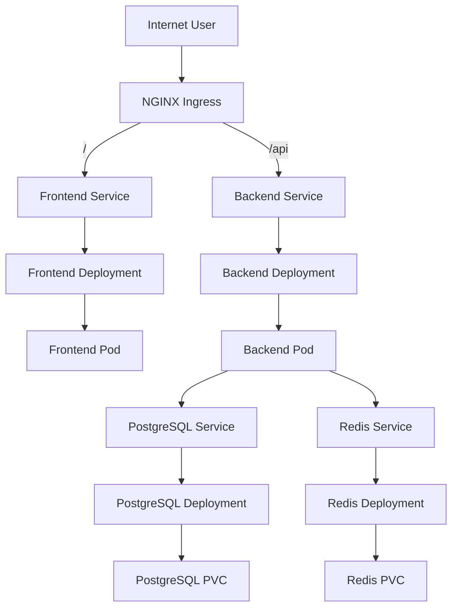

# Kubernetes Architecture

## Overview
This design deploys the BMI Health Tracker into a dedicated Kubernetes namespace called `finch`. The architecture separates stateless application workloads from stateful data services and exposes the platform through an NGINX ingress controller.

Core platform components:

- Frontend `Deployment` and `Service`
- Backend `Deployment` and `Service`
- Redis `Deployment`, `Service`, and `PersistentVolumeClaim`
- PostgreSQL `Deployment`, `Service`, and `PersistentVolumeClaim`
- `Ingress` for external traffic routing
- `HorizontalPodAutoscaler` resources for frontend and backend
- Shared `ConfigMap`, namespace definition, and secrets

## Architecture Diagram


## Manifest Breakdown
### `kubernetes/namespace.yaml`
Creates the dedicated `finch` namespace so all application resources are isolated from the rest of the cluster.

### `kubernetes/configmap.yaml`
Stores non-sensitive runtime configuration for the backend, including:

- `NODE_ENV`
- `PORT`
- `FRONTEND_URL`
- `REDIS_URL`

### `kubernetes/secrets/db-credentials.yaml`
Stores PostgreSQL connection details and the `DATABASE_URL` used by the backend.

### `kubernetes/secrets/api-keys.yaml`
Stores API-related secrets such as `JWT_SECRET` and a placeholder `API_KEY`.

### `kubernetes/frontend-deployment.yaml`
Defines the stateless frontend deployment and service.

Design choices:

- 2 replicas for basic availability
- `RollingUpdate` strategy for zero-downtime updates
- readiness and liveness checks on `/healthz`
- `ClusterIP` service because traffic should enter through Ingress
- Docker image: `${DOCKERHUB_USERNAME}/bmi-health-frontend:latest`

### `kubernetes/backend-deployment.yaml`
Defines the stateless backend deployment and service.

Design choices:

- 2 replicas for high availability
- `RollingUpdate` strategy
- environment injected from `ConfigMap` and `Secret`
- readiness and liveness checks on `/health`
- `ClusterIP` service for internal cluster routing
- Docker image: `${DOCKERHUB_USERNAME}/bmi-health-backend:latest`

### `kubernetes/postgresql-deployment.yaml`
Defines PostgreSQL as a stateful single-replica workload.

Design choices:

- single replica for assignment simplicity
- `Recreate` strategy to avoid multiple pods writing to the same volume
- `PersistentVolumeClaim` named `postgresql-pvc`
- resource sizing suitable for a small development workload

### `kubernetes/redis-deployment.yaml`
Defines Redis as a stateful cache/data service.

Design choices:

- single replica
- append-only mode enabled for persistence
- `PersistentVolumeClaim` named `redis-pvc`
- separate service for internal access from backend pods

Note: the current application does not actively use Redis at runtime, but Redis is included because the assignment requires architecture coverage for external services and it provides a clear extension point for caching, sessions, or queueing later.

### `kubernetes/ingress.yaml`
Exposes the application externally through an NGINX ingress controller.

Routing:

- `/` -> `frontend` service on port `80`
- `/api` -> `backend` service on port `3000`

This keeps the frontend publicly accessible while also allowing direct API routing through the ingress layer.

### `kubernetes/hpa.yaml`
Adds CPU-based horizontal autoscaling for the frontend and backend deployments.

## Resource Allocation
### Frontend
- Requests: `50m CPU`, `64Mi memory`
- Limits: `250m CPU`, `256Mi memory`

### Backend
- Requests: `100m CPU`, `128Mi memory`
- Limits: `500m CPU`, `512Mi memory`

### Redis
- Requests: `50m CPU`, `128Mi memory`
- Limits: `250m CPU`, `256Mi memory`

### PostgreSQL
- Requests: `100m CPU`, `256Mi memory`
- Limits: `500m CPU`, `512Mi memory`

These values are intentionally conservative for a small assignment environment while still showing production-style request/limit separation.

## Scaling Strategy
- Frontend HPA scales from 2 to 5 replicas at 70% average CPU utilization.
- Backend HPA scales from 2 to 6 replicas at 70% average CPU utilization.
- PostgreSQL remains a single replica because shared-write database clustering is outside the scope of this assignment.
- Redis remains a single replica for simplicity; high availability can be added later via Redis Sentinel or a managed service.

## Networking Design
- External traffic enters through the NGINX ingress controller.
- Kubernetes DNS provides internal service discovery using service names such as `backend`, `postgresql`, and `redis`.
- Frontend and backend services are `ClusterIP` because they should not be exposed directly outside the cluster.

## Persistence Design
- PostgreSQL uses a `10Gi` PVC to retain relational data across pod restarts.
- Redis uses a `2Gi` PVC to persist append-only data for cache durability in this assignment design.

## Deployment Order
```bash
kubectl apply -f kubernetes/namespace.yaml
kubectl apply -f kubernetes/configmap.yaml
kubectl apply -f kubernetes/secrets/
kubectl apply -f kubernetes/postgresql-deployment.yaml
kubectl apply -f kubernetes/redis-deployment.yaml
kubectl apply -f kubernetes/backend-deployment.yaml
kubectl apply -f kubernetes/frontend-deployment.yaml
kubectl apply -f kubernetes/hpa.yaml
kubectl apply -f kubernetes/ingress.yaml
```

## Notes
- Replace `YOUR_DOCKERHUB_USERNAME` in the deployment manifests before applying them to a real cluster.
- The cluster must already have an NGINX ingress controller and metrics server installed for Ingress and HPA to work correctly.
- For production use, PostgreSQL and Redis would usually move to StatefulSets or managed services, but Deployments are acceptable here for a compact assignment design.
