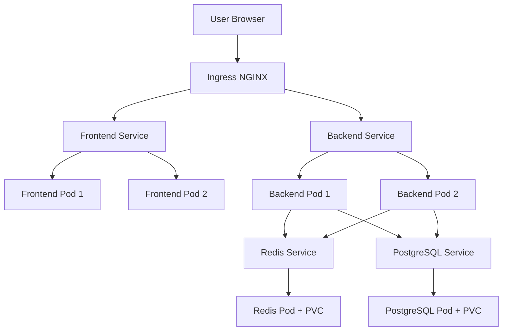

# Kubernetes Architecture

## Target architecture
The deployment is organized in a dedicated namespace called `finch`.

### Core workloads
- **Frontend deployment** with 2 replicas
- **Backend deployment** with 2 replicas
- **Redis deployment** with persistent storage
- **PostgreSQL deployment** with persistent storage
- **Ingress** for external HTTP routing
- **Horizontal Pod Autoscaler** for frontend and backend

## Resource allocation
### Frontend
- Request: `50m CPU`, `64Mi memory`
- Limit: `250m CPU`, `256Mi memory`

### Backend
- Request: `100m CPU`, `128Mi memory`
- Limit: `500m CPU`, `512Mi memory`

### Redis
- Request: `50m CPU`, `128Mi memory`
- Limit: `250m CPU`, `256Mi memory`

### PostgreSQL
- Request: `100m CPU`, `256Mi memory`
- Limit: `500m CPU`, `512Mi memory`

## Scaling strategy
- Frontend HPA: 2 to 5 replicas on 70% CPU
- Backend HPA: 2 to 6 replicas on 70% CPU
- PostgreSQL and Redis remain single replica in this assignment for simplicity

## Networking
- The **Ingress** exposes `finch.example.com`
- `/` routes to the frontend service
- `/api` routes to the backend service
- Internal service discovery is handled by Kubernetes DNS

## Persistence
- PostgreSQL uses a `10Gi` PVC
- Redis uses a `2Gi` PVC

## Mermaid architecture diagram


## Apply order
```bash
kubectl apply -f kubernetes/namespace.yaml
kubectl apply -f kubernetes/configmap.yaml
kubectl apply -f kubernetes/secrets/
kubectl apply -f kubernetes/postgresql-deployment.yaml
kubectl apply -f kubernetes/redis-deployment.yaml
kubectl apply -f kubernetes/backend-deployment.yaml
kubectl apply -f kubernetes/frontend-deployment.yaml
kubectl apply -f kubernetes/hpa.yaml
kubectl apply -f kubernetes/ingress.yaml
```
